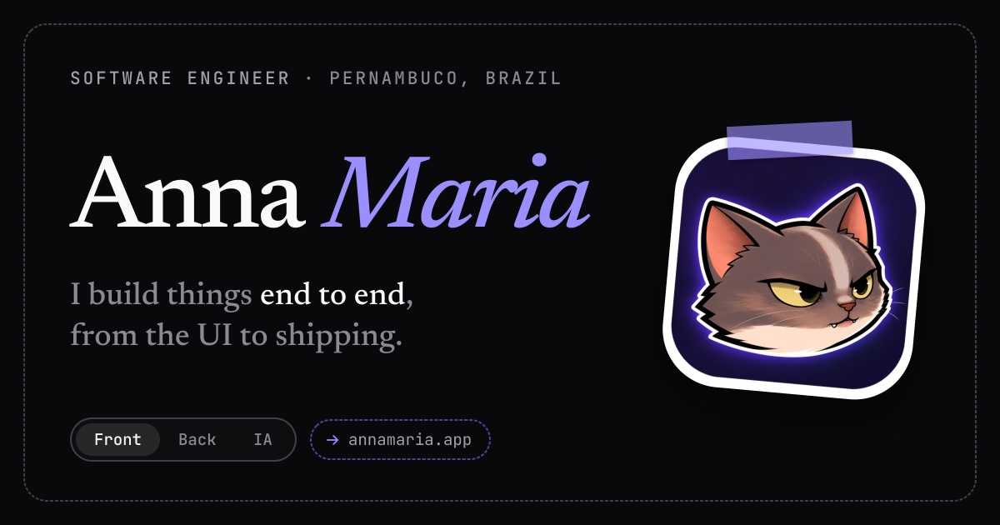

<p align="center">
  
</p>

<p align="center">
  <a href="https://annamaria.app">Live</a> ·
  <a href="https://annamaria.app/blog">Blog</a> ·
  <a href="https://annamaria.app/projects">Projects</a> ·
  <a href="https://entrepta.vercel.app">entrepta</a>
</p>

<p align="center">
  <a href="https://github.com/imnotannamaria/anna.maria.dev/actions/workflows/test.yml"></a>
  
  
  
</p>

# anna.maria.dev

A personal site posed as a code editor. Tabs across the top, an icon rail on the side, a status bar at the bottom, and a command palette on ⌘K. Every page reads as an open file.

It is also an open source template for full-stack engineers: fork it, swap in your own name, content and keys, and deploy.

## What's inside

| Page          | What it is                                                                                                     |
| ------------- | -------------------------------------------------------------------------------------------------------------- |
| `/`           | A bento grid: profile, featured work, open source, a Spotify playlist, Apple Watch rings, GitHub contributions |
| `/about`      | Bio, career timeline, the stack as an interactive graph, a contributions calendar                              |
| `/blog`       | MDX posts grouped by year, with tag filters, Shiki highlighting and a reading progress bar                     |
| `/projects`   | Case studies with a cover, sidebar metadata and MDX                                                            |
| `/log`        | One feed for everything I finish: films, series, books, albums, podcasts, games, with ratings                  |
| `/roadmap`    | A board of what the site is going to become: to do, in progress, shipped                                       |
| `/contact`    | A form sent through Resend and React Email, with a honeypot                                                    |
| `/components` | The site's own cards, each shown in every state it can be in                                                   |
| `/piano`      | A two-octave Web Audio piano                                                                                   |
| `/admin`      | CRUD for the log and the roadmap, behind WorkOS AuthKit and an email allowlist                                 |

Six brand themes in dark and light, dynamic OG images, a sitemap and canonical URLs come with it. Spotify, the Apple Watch card, the log and the roadmap are all optional: without their keys the site still builds, and each one shows an empty state.

## Stack

Next.js 16 (App Router), React 19, TypeScript strict, Tailwind v4 and [entrepta](https://entrepta.vercel.app) for the design system. MDX through Velite and Shiki, Motion for animation, Postgres through Drizzle, a Hono API at `/api/v1`, WorkOS AuthKit for the admin, Resend for email. Deployed on Vercel.

## Built on entrepta

The UI runs on [entrepta](https://github.com/imnotannamaria/entrepta), a dark-first design system with the same editor metaphor. entrepta started inside this site, and v2 was built here first.

It is not a runtime dependency. Its CLI copies source into the repo, and three places belong to it rather than to the site:

- `app/components/entrepta/`, the components
- `app/entrepta.css`, the tokens, the six themes, the reset and the loading classes
- `lib/utils.ts`, `lib/motion.ts`, `lib/icon.tsx`, `lib/overlay.ts` and the hooks in `hooks/`

What the site adds on top lives elsewhere: its CSS in `app/globals.css`, its helpers in `lib/format.ts`, and `components/chrome/`, which binds entrepta's Sidebar, PageOutline and TabNav to the site's routes.

To update a component, run `npx @entrepta/cli@latest add <name> --overwrite` and read the diff. To update the tokens, bump `@entrepta/registry` in `devDependencies` and run `npx vitest run lib/entrepta-sync.test.ts`, which lists what changed.

**Don't run `entrepta init --overwrite` here.** It rewrites `app/globals.css`, which holds the site's own CSS, and adds a Google Fonts import that fights `next/font`.

## Fork it

### 1. Install

```bash
git clone https://github.com/imnotannamaria/anna.maria.dev.git my-site
cd my-site
npm install
```

### 2. Environment

```bash
cp .env.example .env.local
```

Only two variables are required:

```bash
RESEND_API_KEY=re_xxxxxxxxxxxx          # resend.com
NEXT_PUBLIC_BASE_URL=https://yourdomain.com
```

Everything else in `.env.example` is optional and switches on one feature: Spotify, Postgres for the log, roadmap and Apple Watch card, WorkOS for the admin, a GitHub token for the contributions grid.

### 3. Make it yours

| File                         | What to change                              |
| ---------------------------- | ------------------------------------------- |
| `lib/site-config.ts`         | Name, email, social handles, theme swatches |
| `app/(home)/page.tsx`        | The home page sections                      |
| `app/about/page.tsx`         | Bio, timeline, stack, interests             |
| `app/layout.tsx`             | Site title and description                  |
| `app/api/contact/route.ts`   | The `from` and `to` of contact emails       |
| `lib/metadata.ts`            | The `baseUrl` fallback                      |
| `public/images/og-cover.png` | The share image                             |

### 4. Run

```bash
npm run dev:local
```

`npm run dev` is the same thing wrapped in [Infisical](https://infisical.com), which is how the live site keeps its secrets out of the working tree. On a fork, `dev:local` reads your `.env.local` instead.

Open [localhost:3000](http://localhost:3000).

## Writing content

A post is `content/blog/<slug>.mdx`:

```mdx
---
title: "Your post title"
description: "A short description for SEO and cards."
date: "2026-01-01"
tags: ["next.js", "typescript"]
published: true
---

Your content here.
```

A project is `content/projects/<slug>.mdx`:

```mdx
---
title: "Project name"
description: "What it does in one sentence."
date: "2026-01-01"
tags: ["react", "typescript"]
github: "https://github.com/you/project"
live: "https://project.vercel.app"
cover: "/projects/project.png"
featured: true
published: true
---

## Overview

...
```

`cover` is optional and points at a file in `public/projects/`; without one, the card draws a cover from the slug. The most recent `featured: true` project shows on the home page.

## Optional features

### Spotify playlist

Create an app in the [Spotify Developer Dashboard](https://developer.spotify.com/dashboard), then set `SPOTIFY_CLIENT_ID`, `SPOTIFY_CLIENT_SECRET` and the ID of a public playlist in `SPOTIFY_PLAYLIST_ID`. It uses the Client Credentials flow, server to server, so the secret never reaches the browser.

### The log and the roadmap

Both read the same Postgres database.

1. Set `DATABASE_URL` (on Supabase, the transaction pooler string on port 6543) and run [docs/sql/001-log-entries.sql](docs/sql/001-log-entries.sql) and [docs/sql/003-roadmap-items.sql](docs/sql/003-roadmap-items.sql) against it.
2. Seed sample data if you like: `npm run seed:log` and `npm run seed:roadmap`.
3. For the admin, create an application at [workos.com](https://workos.com), register `<your-domain>/api/auth/callback` as a redirect URI, and fill in the four `WORKOS_*` variables.
4. Put your email in `ADMIN_EMAILS`.

The last step matters. AuthKit decides who is signed in, not who is allowed in; without the allowlist, anyone who signs up in your WorkOS organisation reaches the admin. `lib/auth/require-admin.ts` is the real guard.

Roadmap items start as `raw`, which never renders publicly: somewhere to keep an idea before deciding anything about it. The design behind each feature is in [docs/log-plan.md](docs/log-plan.md) and [docs/roadmap-component-plan.md](docs/roadmap-component-plan.md).

### Apple Watch rings

The activity card reads from the same database, fed by an iOS Shortcut. [wristkit](https://wristkit-web.vercel.app/) has the full setup: the migration ([docs/sql/002-wristkit-samples.sql](docs/sql/002-wristkit-samples.sql)), the Shortcut, and the sync endpoint at `/api/v1/wristkit/sync`.

### Sound effects

A short click plays on buttons and nav controls, and success and error cues play on form submissions and admin actions. The files in `public/sounds/` are generated once with the [ElevenLabs Sound Effects API](https://elevenlabs.io/docs/api-reference/text-to-sound-effects/convert) and committed, so visitors never talk to ElevenLabs. To regenerate them, set `ELEVENLABS_API_KEY` and run `npm run generate:sounds`; the prompts live in `lib/sound-effects.ts`.

## Testing

```bash
npm run test:all
```

One command runs every layer: 173 unit tests, 38 integration tests against a real Postgres, and 9 end-to-end tests in a real browser. It starts a throwaway database in Docker, builds what each layer needs and tears it all down afterwards. Docker or OrbStack has to be running; nothing else needs setting up.

```bash
npm run test:all -- --keep     # leave the database up for a faster rerun
npm run test:all -- --no-e2e   # skip the browser layer and its production build
npm test                       # unit tests only, no infrastructure
```

The integration and e2e suites write to and truncate their database, so both refuse to run unless `DATABASE_URL` points at localhost. The e2e layer needs a browser once: `npx playwright install --with-deps chromium`. What each test guards against, and why nothing mocks Postgres, is in [docs/tests-plan.md](docs/tests-plan.md).

## Deploy

Import the repo at [vercel.com/new](https://vercel.com/new), add the environment variables, and deploy. The sitemap and robots.txt are generated at build time.

## Project structure

```
app/
  (home)/                  home page, loading and error states
  about/ blog/ projects/   content pages, lists and [slug]
  log/ roadmap/            public feeds read from Postgres
  contact/ piano/ components/
  admin/                   log and roadmap CRUD, behind AuthKit + the allowlist
  components/entrepta/     entrepta components, written by its CLI
  api/                     contact, OG images, Spotify, auth callback, the Hono app at v1/
  entrepta.css             entrepta's tokens and themes
  globals.css              the site's own CSS
  layout.tsx               editor chrome, fonts, theme setup

components/
  chrome/                  titlebar, sidebar, outline, palette, feed shell
  home/ about/ blog/ projects/ log/ roadmap/ contact/ piano/ spotify/ wristkit/ admin/
  ui/                      error screen, sound feedback, generated cover, meta grid

content/                   blog/, projects/ and components/ in MDX
emails/                    the React Email template
lib/                       API, auth, database, queries, site config, helpers
docs/                      design plans and the SQL migrations
```

## License

MIT. Built by [Anna Maria](https://annamaria.app).
